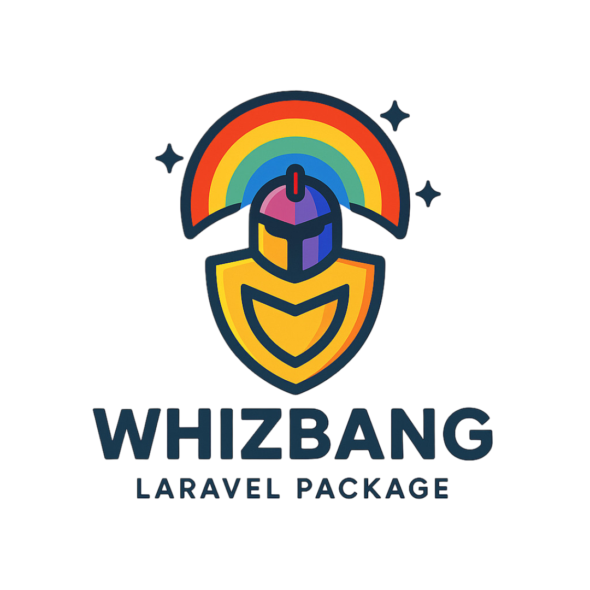

<div align="center">



# 🛡️ Whizbang – Laravel Database Safety Package

**The ONE thing Laravel is desperately missing that EVERY developer needs!**
Automatic database schema change tracking, safety analysis, and instant rollback system for Laravel migrations.

[](https://packagist.org/packages/ludovicguenet/whizbang)
[](https://laravel.com)
[](https://packagist.org/packages/ludovicguenet/whizbang)

[Installation](#-installation) • [Quick Start](#-quick-start) • [Features](#-features) • [Commands](#-commands) • [Use Cases](#-use-cases) • [Contributing](#-contributing)

</div>

---

> ⚠️ **Production Safety Tool**: Whizbang is designed to **protect live databases**. Use it in development *and* production to prevent irreversible data loss.

---

## 💥 The Problem

1. You run `php artisan migrate` in production.
2. Migration drops a column with important data → **GONE FOREVER**.
3. App breaks → **NO EASY WAY BACK**.
4. Boss asks *"What changed?"* → ¯\\_(ツ)_/¯

Laravel migrations are one-way by default. Once destructive changes happen, there’s no built-in recovery or audit trail.

---

## ✅ The Solution: Whizbang

An **automatic safety net** for database changes that Laravel doesn’t provide.

---

## ✨ Key Features

- **📸 Auto-Snapshots** – Capture schema before *every* migration
- **🛡️ Danger Detection** – Warn about risky operations (DROP TABLE, DROP COLUMN, etc.)
- **🔄 Rollback Flow** – Execute a rollback procedure with safety checks; table recreation steps are currently logged (scaffold), not auto-applied
- **⚡ Risk Analysis** – Calculate rollback safety before executing
- **📊 Change Tracking** – Complete audit trail of what changed and when

---

## 🚨 Real-World Example

```bash
php artisan migrate
# 📸 Pre-migration snapshot saved (ID: 123)
# ⚠️  DANGEROUS CHANGES DETECTED!
# ❌ Column 'users.email' was dropped (Risk: HIGH)
# 🔄 To rollback, use: php artisan schema:rollback 123
```

---

## 📋 Requirements

- **PHP** 8.2+
- **Laravel** 11.0+
- Database supported by Laravel Migrations

---

## 📦 Installation

### Install Package

```bash
composer require ludovicguenet/whizbang
```

### Publish Config

```bash
php artisan vendor:publish --tag=whizbang-config
```

### Run Migrations

```bash
php artisan migrate
```

---

## 🚀 Quick Start

### Manual Snapshot

```bash
php artisan schema:snapshot --reason="before-hotfix"
```

### Risk Analysis

```bash
php artisan schema:status
# Recent Snapshots:
# ID  | Reason        | Created At          | Tables
# 123 | pre_migration | 2024-08-11 10:30:00 | 15
# 122 | manual        | 2024-08-11 09:15:00 | 15
```

### Rollback Flow

```bash
php artisan schema:rollback 123
# ⚠️  You are about to rollback your database schema!
# ✅ Rollback safety check passed
# Are you absolutely sure? (yes/no): yes
# ✅ Rollback flow executed. Table recreation steps were logged (no destructive actions applied automatically)
```

---

## ⚙️ Commands

```bash
# Take a snapshot
php artisan schema:snapshot --reason="before-release"

# Check status and history
php artisan schema:status

# Rollback to a snapshot
php artisan schema:rollback 123

# Force rollback (skip safety checks)
php artisan schema:rollback 123 --force
```

---

## 🎯 Use Cases

- **Production Deployments** – Auto-snapshot before migrations
- **Hotfixes** – Quick rollback when things go wrong
- **Schema Auditing** – Track all database changes
- **Team Safety** – Prevent dangerous operations
- **Compliance** – Maintain schema change history

---

## ❓ Why This Doesn’t Exist in Laravel

Laravel focuses on **forward migrations**, but offers no built-in way to:

- Track actual schema changes
- Analyze safety of those changes
- Rollback schema changes without full backups
- Warn about dangerous operations

**Every Laravel developer has been burned by this.**
Whizbang closes that gap.

---

## 🤝 Contributing

We welcome contributions!

```bash
git clone https://github.com/ludoguenet/whizbang.git
cd whizbang
composer install
vendor/bin/pest
```

---

## 📜 License

Whizbang is open-source software licensed under the [MIT License](LICENSE).

---

## 🔒 Security

If you discover security vulnerabilities, please email **ludo@epekta.com** instead of using the issue tracker.

---

<div align="center">

**🛡️ Made with ❤️ by [Ludovic Guénet](https://ludovicguenet.me) for the Laravel community 🛡️**

[Website](https://ludovicguenet.me) • [Support](mailto:ludo@epekta.com)

</div>
